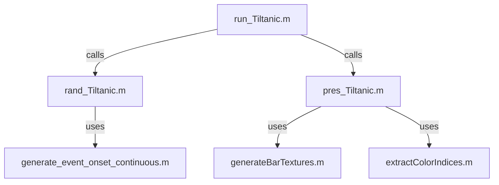

# Tiltanic Experiment – Perceptual Threshold Measurement in Competitive Stimulus Configuration

**Tiltanic** is a MATLAB-based Psychtoolbox experiment designed to study perceptual contrast thresholds in a competitive stimulus configuration. This is a pre-experiment for Tiltopia. Participants detect target shapes formed by oriented bars embedded in a dynamic background.

---

## Folder Structure

```
Tiltanic/
├── run_Tiltanic.m           # Main experiment entry script
├── pres_Tiltanic.m          # Trial presentation loop
├── rand_Tiltanic.m          # Trial randomization and event generation
├── generateBarTextures.m    # Creates textures and rotations for bar stimuli
├── generate_event_onset_continuous.m  # Jittered timing for background & foreground events
├── extractColorIndices.m    # Extracts shape pixel indices from TIFF images
├── logfiles/                # Output folder for participant data (*.mat)
└── images/                  # Folder with .tiff shape templates for bar locations
```

---

## Experiment Structure

The experiment includes **Static Bar Arrays (SBA)** with shapes formed by orientation contrasts and **Random Dot Kinematograms (RDKs)** as visual distractors. Each trial presents one shape at a time. Participants judge whether it matches a defined **target shape**.

### Experiment Flow

1. **Shape Learning Phase**
2. **Training Trials (simplified difficulty)**
3. **Main Experiment Trials (16 × ~1.5 min each)**

---

## Script Dependencies

How the main components connect:



Each function is modular and documented with detailed headers.

---

## Output Data Structure

After completing the experiment, all relevant output data are saved in a `.mat` file named using the following pattern:

```
logfiles/VPXX_timing.mat
```

Where `XX` is the subject number (e.g., `VP01_timing.mat`). This file includes all essential variables needed for analysis and reproducibility of the experiment.

### Stored Variables

| Variable        | Type        | Description |
|----------------|-------------|-------------|
| `p`            | `struct`    | Global experiment parameters (timing windows, display settings, response windows, etc.) | 
| `RDK`          | `struct`    | Parameters for the Random Dot Kinematogram (e.g., dot color, speed, direction, frequency) |
| `SBA`          | `struct`    | Static Bar Array configuration including shape events, colors, orientations, and stimulus layout |
| `timing`       | `struct[]`  | Flip-wise stimulus presentation timing, collected via Psychtoolbox timing functions |
| `button_presses` | `struct`  | Keypress timestamps and mappings to response buttons |
| `resp`         | `struct[]`  | Trial-wise behavioral responses: RTs, response classification (hit/miss/FA), and stimulus metadata |
| `randmat`      | `struct`    | Randomization matrix specifying the order and parameters of stimuli and trials (from `rand_Tiltanic`) |

---

## 👩‍🔬 Requirements

- MATLAB R2020+
- Psychtoolbox 3.x
- Standard keyboard and display
- `.tiff` shape templates in `images/` folder

---

## 📣 Citation

If you use this experiment or parts of it in your work, please cite the associated publication (forthcoming) or credit the developers.

---

## Author

**Sebastian Wehle**  
University of Leipzig, 2025  
[GitHub Profile](https://github.com/miranodeliciosa) 

---